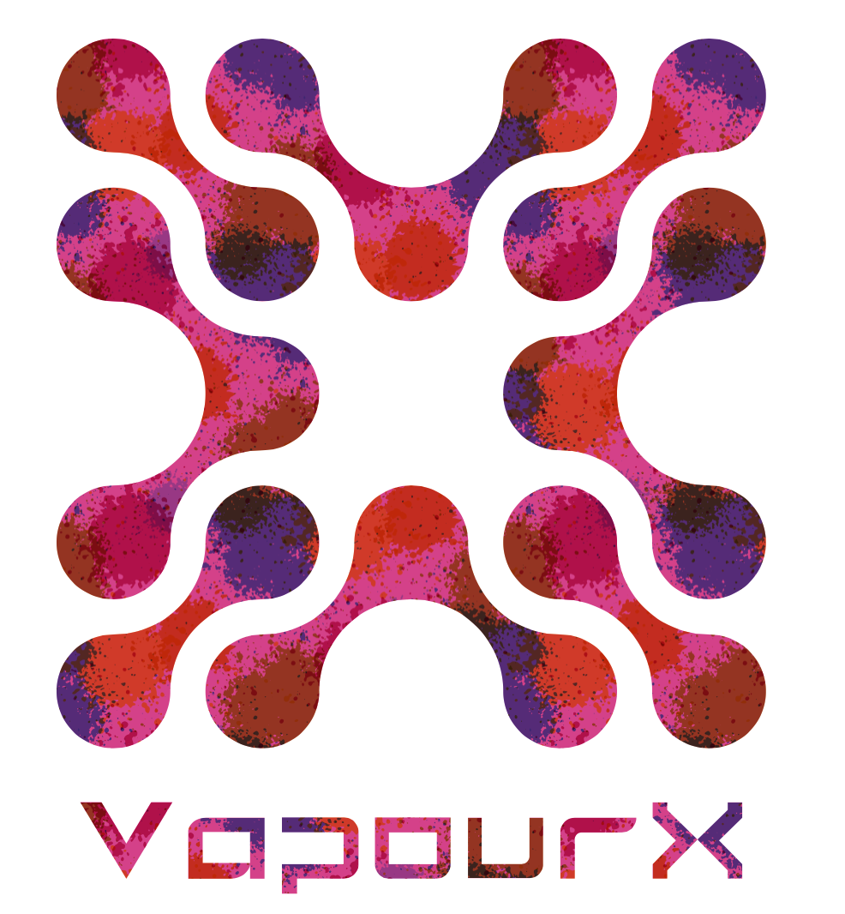

# VapourX Open Forum

  

  
<strong>人机合一，化具象为抽象</strong>

  

    
    
    
    
  

## 📊 GitHub Star History

  

## 📈 Repository Statistics

  
  

## 🌟 Top Languages

  

## 📊 Repository Views

  

## 🚀 About VapourX

VapourX is uniting a passionate community of embodied intelligence enthusiasts, professionals, and researchers to pioneer natural interaction among humans, digital humans, and robots — driving the seamless evolution of embodied intelligence from research to real-world impact across industry and innovation.

## 📚 Featured Content

- **🎯 Exciting Papers**: Curated collection of influential research papers in robotics, computer vision, and machine learning
- **📝 Daily Blog**: Daily embodied intelligence and AIGC learning records
- **🔬 Research Highlights**: Latest developments in embodied intelligence research

## 🌐 Website

Visit our website: [VapourX Open Forum](https://acondaway.github.io/vapourx/)

## 🤝 Contributing

We welcome contributions! Please feel free to submit a Pull Request.

## 📄 License

This project is licensed under the MIT License - see the [LICENSE](LICENSE) file for details.

---

  
Made with ❤️ by the VapourX Community

